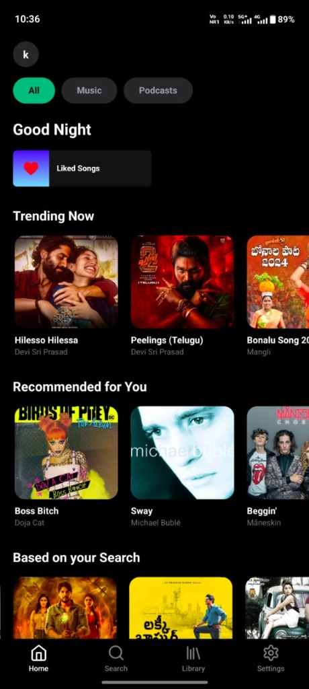
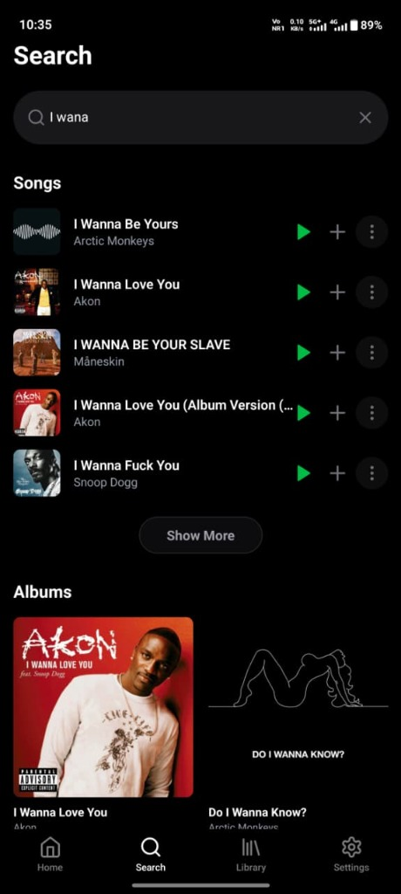
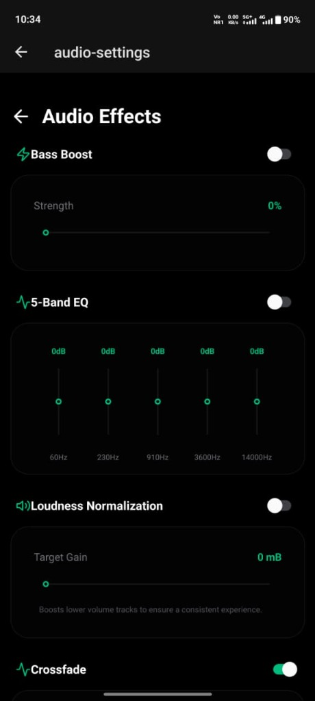
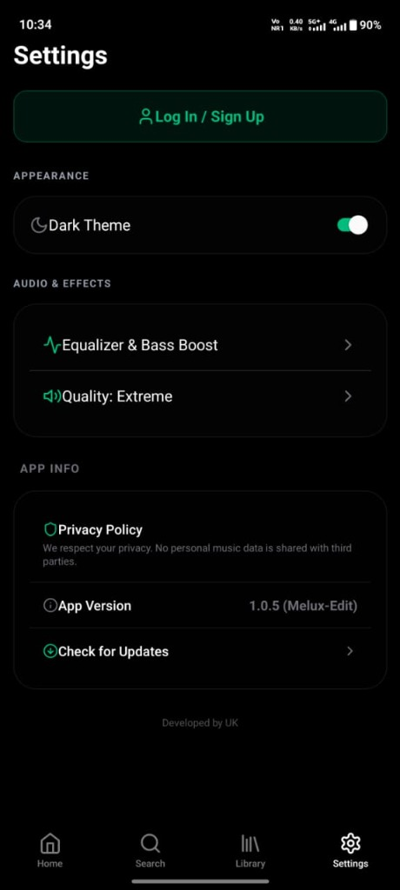
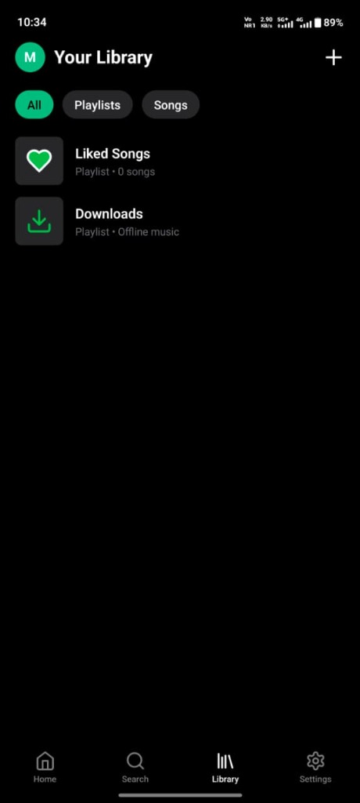
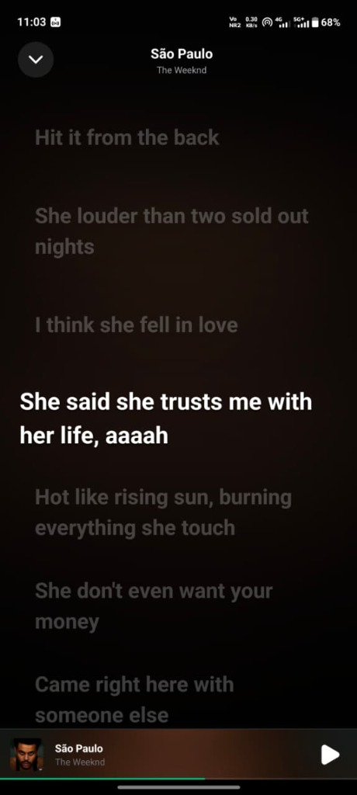
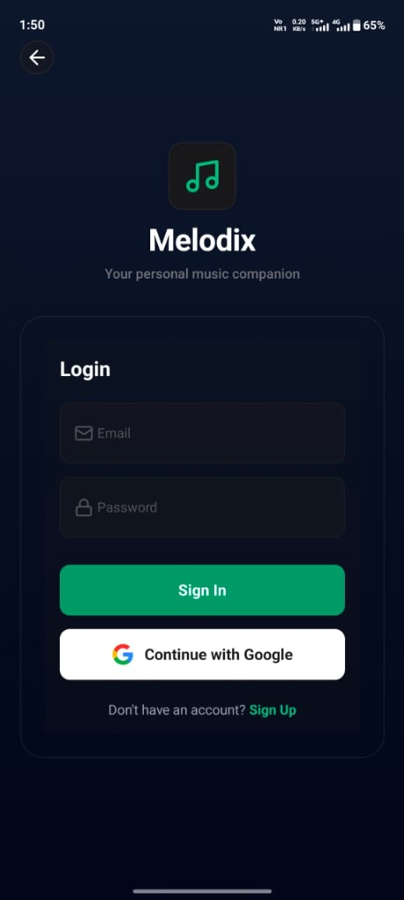

# Melodix

Melodix is a premium, high-performance **free music streaming** application built with React Native and Expo. It features a stunning glassmorphism-inspired UI and a custom native audio engine for unparalleled sound control, providing unlimited access to millions of songs with no ads.

## 📱 Previews

<div align="center">
  <table>
    <tr>
      <td></td>
      <td></td>
      <td></td>
    </tr>
    <tr>
      <td align="center"><b>Home</b></td>
      <td align="center"><b>Player</b></td>
      <td align="center"><b>Search</b></td>
    </tr>
    <tr>
      <td></td>
      <td></td>
      <td></td>
    </tr>
    <tr>
      <td align="center"><b>Audio Effects</b></td>
      <td align="center"><b>Settings</b></td>
      <td align="center"><b>Library</b></td>
    </tr>
    <tr>
      <td></td>
      <td></td>
      <td></td>
    </tr>
    <tr>
      <td align="center"><b>Lyrics</b></td>
      <td align="center"><b>App Icon</b></td>
      <td align="center"><b>Login</b></td>
    </tr>
  </table>
</div>

## ✨ Key Features

- **Free Music Streaming**: Unlimited access to millions of songs without any subscription fees or ads.
- **High-Fidelity Streaming**: Guaranteed 320 kbps audio quality for a crystal-clear listening experience.
- **Native Audio Engine**: Custom-built Expo module interfacing directly with Android's native audio effects.
  - **5-Band Equalizer**: Fine-tune your sound with clinical precision.
  - **Bass Boost**: Powerful, adjustable low-end enhancement.
  - **Loudness Normalizer**: Consistent volume levels across all tracks.
- **Google Authentication**: Seamless and secure login experience with Google Sign-In support.
- **Premium UI/UX**: Modern glassmorphism design with premium row previews, smooth animations, and haptics.
- **Advanced Offline Support**: Full offline playlist support with persistent library state, recently added song image updates for the downloads folder, and robust "Play All/Shuffle" controls.
- **Reliability & Stability**: Comprehensive defensive coding and crash prevention logic for seamless playback even with incomplete metadata or poor connectivity.
- **Public Storage Sync**: Robust MediaStore integration for Android 11+, ensuring downloads are visible in other apps and synced automatically.
- **Global State Management**: Powered by Zustand for a lightning-fast and responsive interface.

## 🛠️ Tech Stack

- **Framework**: [React Native](https://reactnative.dev/) + [Expo SDK 55](https://expo.dev/)
- **Language**: TypeScript / Kotlin (Native Modules)
- **Styling**: [NativeWind](https://www.nativewind.dev/) (Tailwind CSS)
- **State Management**: [Zustand](https://github.com/pmndrs/zustand)
- **Navigation**: [Expo Router](https://docs.expo.dev/router/introduction/)
- **Animations**: [Moti](https://moti.fyi/) + [Reanimated 4](https://docs.swmansion.com/react-native-reanimated/)
- **Audio Core**: [React Native Track Player](https://react-native-track-player.js.org/)

## 🚀 Getting Started

### Prerequisites

- Node.js (v18 or newer)
- Android Studio & NDK
- Java 21

### Installation

1. Clone the repository:
   ```bash
   git clone https://github.com/uday-kiran-06/Melodix-Android-App.git
   ```

2. Install dependencies:
   ```bash
   npm install
   ```

3. Setup environment variables:
   Create a `.env` file in the root directory and add your configuration.

4. Run the application:
   ```bash
   # For Android
   npx expo run:android
   ```

## 📜 License

Distributed under the MIT License. See `LICENSE` for more information.

---
<p align="center">Developed with ❤️ by Uday Kiran</p>
